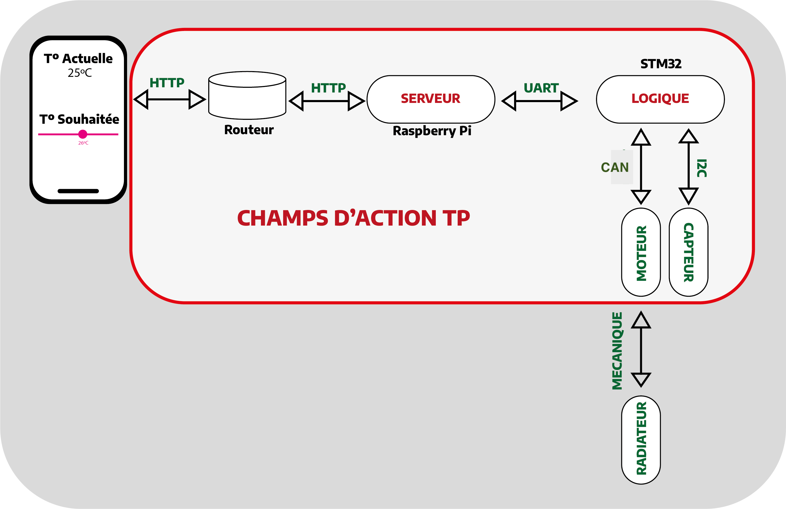

# 
Thermostat Domotique

## Contexte

Le but de ce TP est de comprendre comment utiliser des communications réseaux (API REST), ainsi que des communications via bus (I2C, UART, etc...).

Nous allons pour cela prototyper une application domotique de gestion de chauffage.

Nous nous occuperons de la partie réseau, capteur et asservissement moteur. 

On pourrait très bien imaginer rajouter une UI pour communiquer avec notre serveur, ainsi qu'une vanne commandée par le moteur pour régler l'intensité du chauffage.

## Capteurs BMP280

Le BMP280 est un capteur de pression et température développé par Bosch , la première chose
à faire c’est que nous allons bien lire la datasheet de ce capteur et extraire toute les informations
qu’il nous faut :
Les adresses I²C possibles pour ce composant: 1110110 (0X76) ou 1110111 (0x77) où le
dernier bit sert à définir si on va faire une écriture ou lecture.
Le registre et la valeur permettant d'identifier ce composant: le registre ID 0xB6.
Le registre et la valeur permettant de placer le composant en mode normal: 0xF3 ‘’status’
Les registres contenant l'étalonnage du composant: 0xF4, 0xF5
Les registres contenant la température (ainsi que le format): 0xFA 0xFB 0xFC
Les registres contenant la pression (ainsi que le format): 0xF7 0xF8 0xF9
Les fonctions permettant le calcul de la température et de la pression compensées, en
format entier 32 bits: 

<a>https://github.com/Artpel1805/BusReseauESE/blob/30392f68e8331b5f60fbc16fe17755c1e7d9403b/CUBEIDE/Core/Src/BMP280_simple.c#L167</a>
<a>https://github.com/Artpel1805/BusReseauESE/blob/30392f68e8331b5f60fbc16fe17755c1e7d9403b/CUBEIDE/Core/Src/BMP280_simple.c#L154</a>

### Identification

Pour pouvoir identifier le BMP280 il fallait envoyer par à l’adresse I²C du capteur, l’adresse du registre ID pour pouvoir recevoir le contenu de ce registre .

<a>https://github.com/Artpel1805/BusReseauESE/blob/30392f68e8331b5f60fbc16fe17755c1e7d9403b/CUBEIDE/Core/Src/BMP280_simple.c#L37-L43</a>

On recoit à la fin 0x58 ce qui correpond à la valeur attendu et  on utilise UART pour vérifier si la communication I2C est bien passée.

### Configuration du BMP280

 Nous allons utiliser la configuration suivante: mode normal, Pressure oversampling x16, Temperature oversampling x2.
Pour cela on envoie l'adresse du registre à écrire 0xF4 suivi de la valeur des paramètres et pour cela on fait un déclage de bits et on verifie cela à la fin .

<a>https://github.com/Artpel1805/BusReseauESE/blob/30392f68e8331b5f60fbc16fe17755c1e7d9403b/CUBEIDE/Core/Src/BMP280_simple.c#L58-L64</a>
<a>https://github.com/Artpel1805/BusReseauESE/blob/30392f68e8331b5f60fbc16fe17755c1e7d9403b/CUBEIDE/Core/Src/BMP280_simple.c#L49-L51</a>
## Asservissement Moteur

Les cartes STM32L476 sont équipées d'un contrôleur CAN intégré.Pour pouvoir les utiliser, il faut leur adjoindre un Tranceiver CAN.Le bus CAN pour piloter un module moteur pas-à-pas. Ce module s'alimente en +12V. La carte moteur tolére une vitesse CAN de 500kbit/s.
Pour pouvoir utliser le bus Can on utilise deux primitives HAL HAL_StatusTypeDef HAL_CAN_Start (CAN_HandleTypeDef * hcan) pour pour activer le module CAN etHAL_StatusTypeDef HAL_CAN_AddTxMessage (CAN_HandleTypeDef * hcan, CAN_TxHeaderTypeDef * pHeader, uint8_t aData[], uint32_t * pTxMailbox) pour envoyer un message.
Tout d'abord nous allons commencer par créer une structure pour envoyer notre message ID en standart . Et en choisisant d'envoyer 2 bits pour utilise la function Angle fournin par la DataSheet qui permet de choisir l'angle et le sens désiré . Puis nous référant la position atteinte comme position initiale pour pouvoir continuer de tourner .

## Réseau

### Serveur

Pour la partie Réseau nous utiliserons une Raspberry Pi. Celle-ci dispose d'une carte réseau et après une configuration nous la connectons sur un réseau local.

Nous allons créer un serveur sur cette carte electronique.
Le serveur va nous permettre de manipuler de la donnée et d'executer des ordres via un protocole de communication sans fil.
Plus précisement une API REST. Nous utiliserons le protocole de communication HTTP pour communiquer avec notre serveur.

### HTTP
Le protocole HTTP normalisé de couche 7 dans le modèle OSI. Il utilise un protocole TCP en couche 4.

HTTP est principalement caractérisé par **_les verbes_** qui permettent d'effectuer des actions spécifiques sur la donnée. On peut par exemple citer: 
- GET pour récuperer de la donnée
- POST pour créer de la donnée
- DELETE pour supprimer de la donnée

### Configuration de la Raspberry

Après avoir installé Raspberry Pi OS Lite 32 Bit: <a>https://www.raspberrypi.org/downloads/raspberry-pi-os/</a>

Nous configurons et connectons notre carte à notre réseau.

La Raspberry communique via **_ssh_**, un protocole de communication permetant de se connecter à distance à un ordinateur et d'obtenir un shell. C'est grâce à ce shell que nous allons pouvoir interagir avec l'os.

On peut chercher notre Raspberry sur le réseau avec la commande  `arp -a`

On se connecte ensuite via la commande  `ssh pi@<ip_adresse>`

### Flask

Comme nous l'avons le serveur appartient à la couche 7, c'est principalement un logiciel.

Nous pouvons donc coder notre serveur en C, Ruby, Java, Dart...

Nous choisissons d'utiliser Python car c'est un langage disposant de très bon framework serveur.

On a maintenant accès à notre OS via le shell. Raspberry Pi OS est en fait une surcouche Linux. Nous pouvons donc installer python via le gestionnaire de paquet apt: `sudo apt install python3-pip`

Flask est un framework python permettant de coder assez simplement des API REST.

Nous devons donc installer donc Flask via le gestionnaire de paquet de Python pip.

Une bonne pratique est de lister toutes les dépendances python dans un fichier. Ainsi quelqu'un récupérant le projet ne devra executer qu'une seule commande pour tout installer : [requirement.txt](API/requirement.txt)

Il ne nous reste plus qu'a executer la commande `python3 -m pip install -r requirement.txt`

Nous avons donc installer Flask. Nous pouvons maintenant commencer à coder notre serveur !

Pour construire une route avec Flask il faut lui indiquer : 
- Le Path
- Les verbes autorisés
- Le/Les arguments et leur type (Body/Query/Path Parameter)
- La logique

<a>https://github.com/Artpel1805/BusReseauESE/blob/5573b0998c37098095fd06447441d778647bf6d2/API/flask_api.py#L20</a>

Par exemple ici on voit que le path est "/temp", qu'il y a un Path Parameter "x" et que la requête accepte les verbes POST et GET

Lorsque le serveur reçoit une requête HTTP contenant ces informations il va alors effectuer la fonction ci-dessous.

<a>https://github.com/Artpel1805/BusReseauESE/blob/e33c806981fa3cc1ed17d72aeab58bacde361ed7/API/flask_api.py#L21-L27</a>

Le serveur nous renvois ensuite une réponse constituée de :
- La Data
- Un code de Status : [Status Code](https://developer.mozilla.org/en-US/docs/Web/HTTP/Status)

La Réponse est aussi normalisée, elle est au format JSON, les Satuts code sont aussi noramlisés.

### Connection avec la STM32

Nous avons vu comment communiquer avec notre Raspberry Pi grâce à Flask et l'envois de requêtes HTTP.

Maintenant notre Raspberry Pi doit communiquer avec notre STM32 lors de la réception de requêtes HTTP.

Nous choisissons de communiquer via un **_BUS UART_**.

La Raspberry Pi va donc envoyer des ordres ("Chaines de caractère") à notre STM lors de la reception de commande HTTP et la STM va ainsi pouvoir nous répondre en UART en nous communiquant les données du capteurs ou du moteur. Ensuite nous allons pouvoir les renvoyer via HTTP à l'auteur de la requête.

Le packaque PySerial de Python permet d'utiliser les ports Séries de notre carte.

On l'installe donc via pip en l'ajoutant à notre fichier [requirement.txt](API/requirement.txt)

On voit que le port UART de la Raspberry Pi s'appelle **_ttyAMA0_**.
<a>https://github.com/Artpel1805/BusReseauESE/blob/38bcaade74b0e8bcc69c58af9c7d3fbd5ee3f309/API/uart.py#L3-L4</a>

Lors de la réception d'une requête on va donc envoyer un ordre à la STM32:

<a>https://github.com/Artpel1805/BusReseauESE/blob/38bcaade74b0e8bcc69c58af9c7d3fbd5ee3f309/API/uart.py#L6-L12<a>
  
Qui écoute son port UART via une interruption:
<a>https://github.com/Artpel1805/BusReseauESE/blob/f824173ef8d4d0079d18baedc8db7d83de57e067/CUBEIDE/Core/Src/main.c#L191-L201</a>

Vous pouvez retrouver l'ensemble des requêtes UART: [uart](API/uart.py)

### [BONUS] Fast API

  > Avant d'utiliser et d'installer FastAPI il faut intaller Cargo `sudo apt install cargo`
  
FAST API est un framework python permettant de faire du serveur comme Flask. Il propose cependant une meilleure documentation et la communauté est très active ce qui est un paramètre non-négligeable. Deplus il permet une gestion plus facile et automatisée de l'erreur et du contrôle des paramêtres.

Nous avons choisis ce framework pour le projet final deplus il propose un [swagger](https://swagger.io/tools/swagger-ui/) intégré ce qui rends l'envois de requête beaucoup plus simple et aggréable.
  

  Le principe est le même mais FastAPI va gérer automatiquement les erreurs sur le type des paramêtres (ici `int`) et nous pouvons ajouter des condtions, par exemple l'entier ne doit pas être plus grand que la taille du tableau et plus petit que l'index négatif maximal
  
  <a>https://github.com/Artpel1805/BusReseauESE/blob/c4bb8c6e2e8be94cfdf36a6e242e60eefef9d5f9/API/api.py#L14-L15</a>
  
 Vous pouvez retrouver le projet fastAPI: [FASTAPI](API/api.py)
